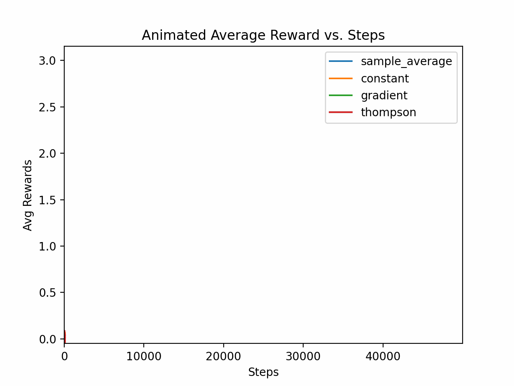
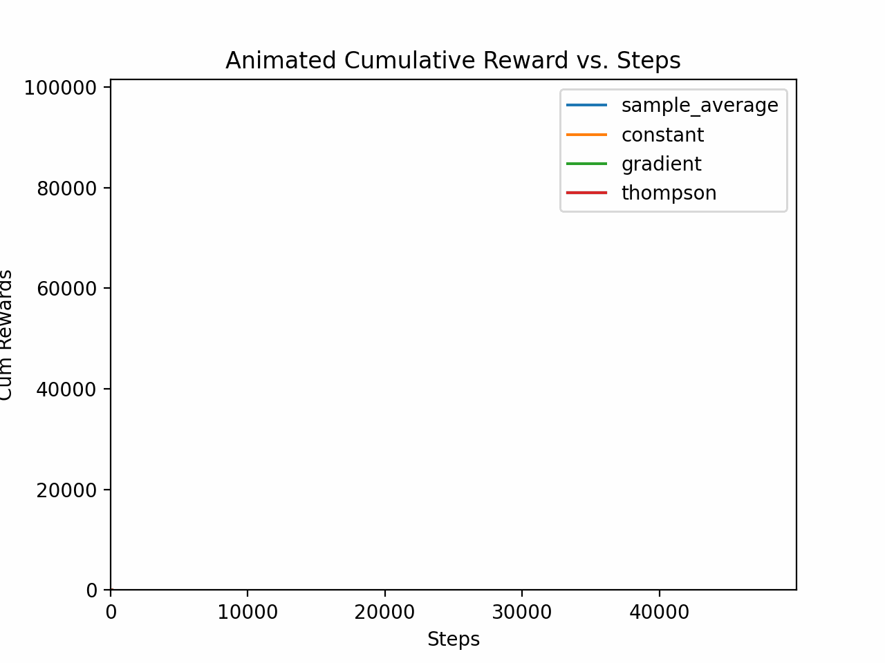
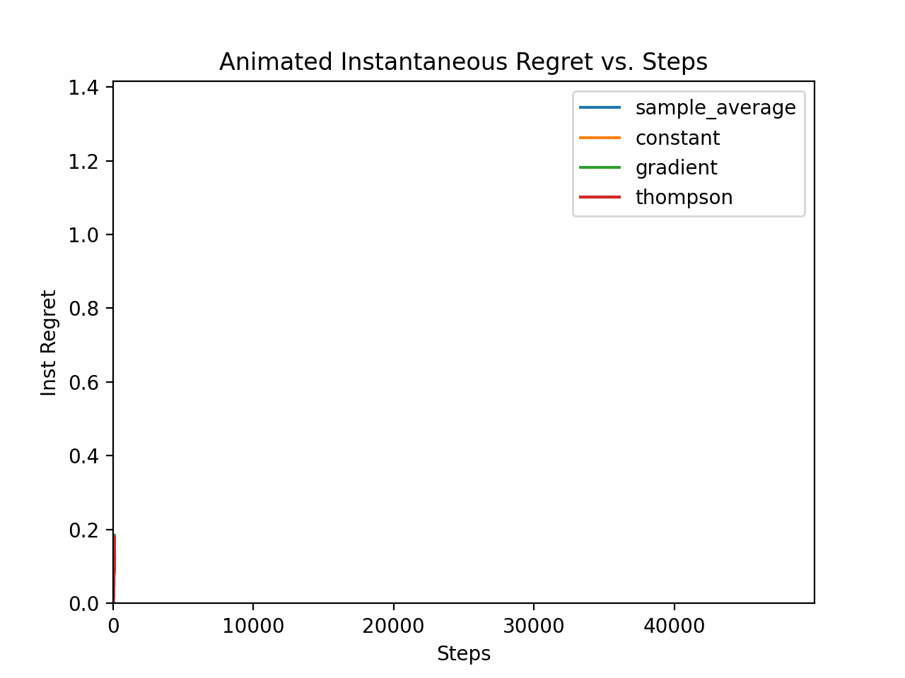
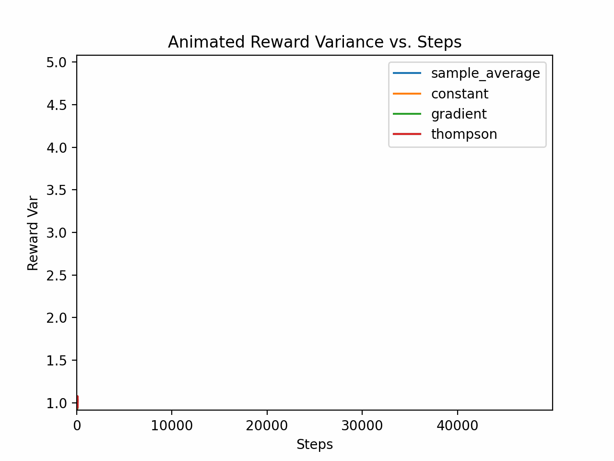

# Nonstationary Bandit Simulation and Deep Performance Analysis

This project compares several bandit algorithms on a nonstationary 10-armed bandit problem. The following animations illustrate the evolution of key performance metrics over time.

## Metrics

| Average Reward | % Optimal Action |
| -------------- | ---------------- |
|  |  |

| Cumulative Reward | Instantaneous Regret | Reward Variance |
| ----------------- | -------------------- | --------------- |
|  |  |  |
